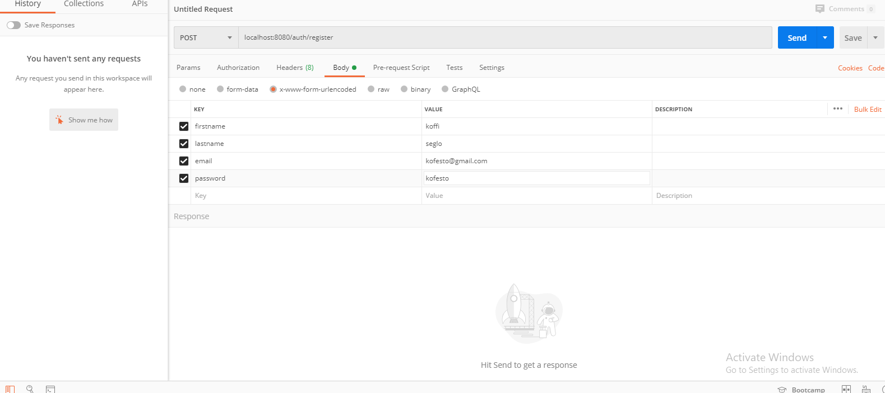
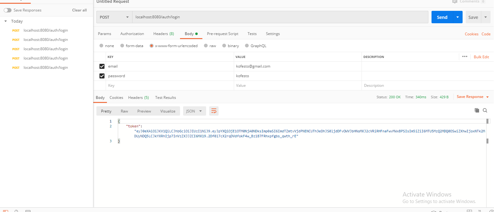
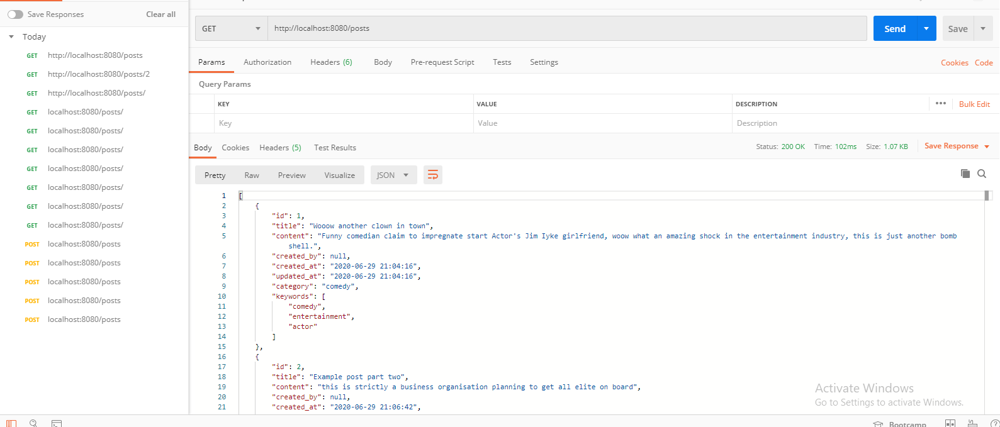
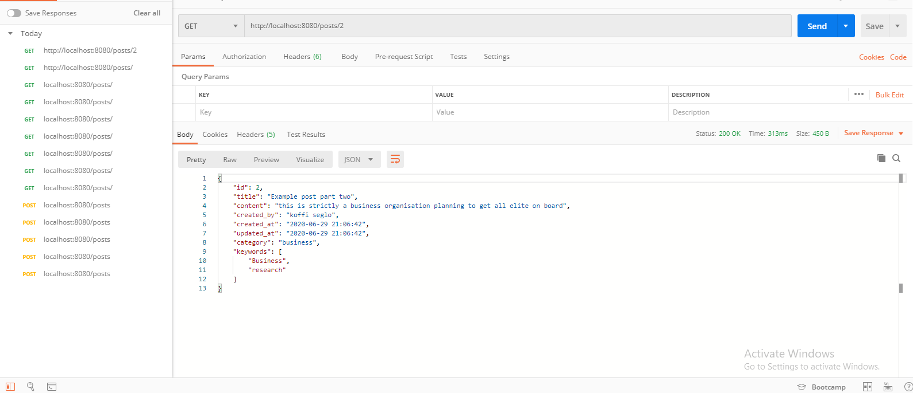
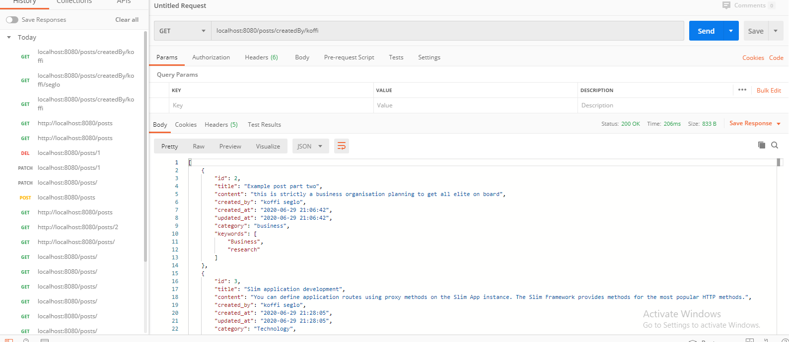
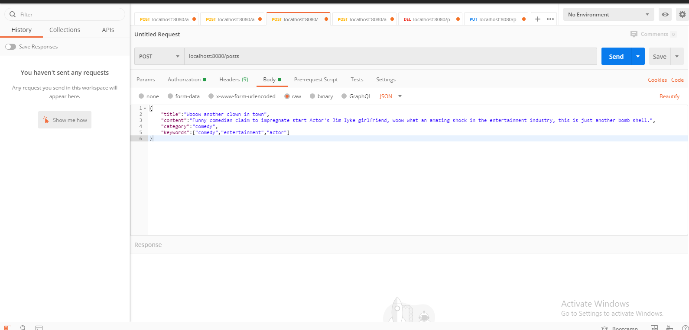
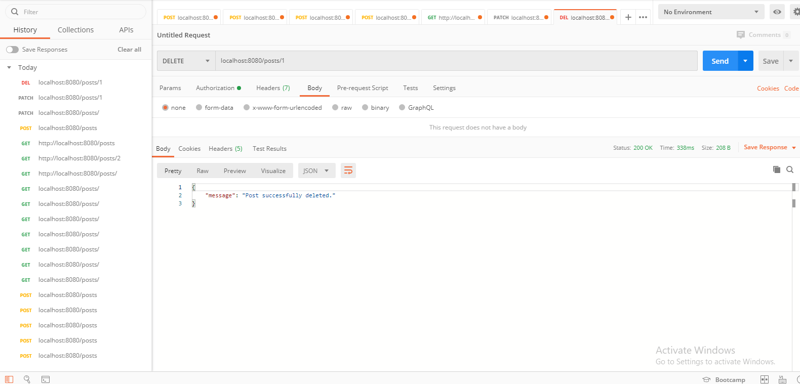
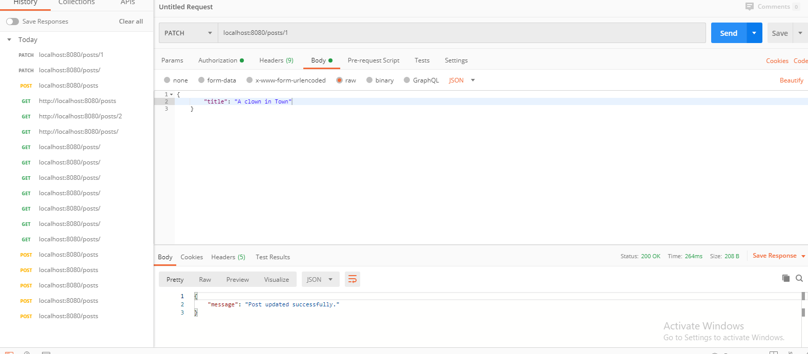

# Restful API Blog

This is a simple Restful API for Blog Service using the Slim Framework.

## Install package dependencies:

* [Git](https://git-scm.com/downloads)
* [Composer](https://getcomposer.org/)
* [Docker](https://docs.docker.com/engine/installation/)


## Usage Clone this repository like so:

```
    git clone https://github.com/kofesto/restful-api-slim-blog.git
```

Change your directory to restful directory like so:

```
    cd restful-api-slim-blog
```    

Install package dependencies:

```
    composer install
```

## Setting up the application manually

If you prefer you can configure every environment manually to run the application by installing the web server with php and the MySQL database. After configuring the environment, you need to set your environment variables to define your database parameters in the .env environment file.

Finally, boot-up the API service with PHP's Built-in web server:

Note: The test has its own environment configuration that is loaded into the virtual file in the mocked application. You can set these settings in the env.php file

```
    composer start
```

### Examples

All examples are shown in POSTMAN.

### Resgistration

You'd need to register as a user to manage posts. The /auth/register route handles user registration.

You can register a user using POSTMAN like so:



Supply your preferred username and password

### Login

You need to get a token to use somes routes. The /auth/login route handles token generation for users. You can get token like so:



Use the returned token to make other requests to restricted routes.

### Get all Posts

To get all post, you send a `GET` request to `/posts` route like so:



### Get a Post
To get an Post, you send a `GET` request to `/post/{id of post}` route like so:



### Search for Emojis
You can search for posts by the posts's `title`, `category` it belongs to and `keyword` associated to it. You can also get all posts `created by` a particular user.  
* `/posts/title/{post title}` to search for post by its `title`
* `/posts/category/{category name}` to search for posts that belongs to a `category`
* `/posts/keyword/{keyword name}` to search for posts that belongs to a `keyword`
* `/posts/createdBy/{creator name}` to search for posts created by a user



### Create Post
To create a post, you send a `POST` request, with your authentication token, to `/posts` route with post's information like so:



### Delete Post
To delete an post, you send a `DELETE` request, with your authentication token, to `/posts/{id of post}` route like so:



`Note: You can only delete a Post you created personally.`

## Update Post
To update post, you send a `PUT` or `PATCH` request, with your authentication token, to `/posts/{id of post}` route with the information you what to update like so:



`Note: You can only update a Post you created personally.`

## Tests

Run the test with `composer test` command

### Credits

[Koffi Seglo](https://github.com/kofesto/)

### License

#### The MIT License (MIT)

Copyright (c) 2020 Koffi K. Seglo <kofesto@gmail.com>

> Permission is hereby granted, free of charge, to any person obtaining a copy
> of this software and associated documentation files (the "Software"), to deal
> in the Software without restriction, including without limitation the rights
> to use, copy, modify, merge, publish, distribute, sublicense, and/or sell
> copies of the Software, and to permit persons to whom the Software is
> furnished to do so, subject to the following conditions:
>
> The above copyright notice and this permission notice shall be included in
> all copies or substantial portions of the Software.
>
> THE SOFTWARE IS PROVIDED "AS IS", WITHOUT WARRANTY OF ANY KIND, EXPRESS OR
> IMPLIED, INCLUDING BUT NOT LIMITED TO THE WARRANTIES OF MERCHANTABILITY,
> FITNESS FOR A PARTICULAR PURPOSE AND NONINFRINGEMENT. IN NO EVENT SHALL THE
> AUTHORS OR COPYRIGHT HOLDERS BE LIABLE FOR ANY CLAIM, DAMAGES OR OTHER
> LIABILITY, WHETHER IN AN ACTION OF CONTRACT, TORT OR OTHERWISE, ARISING FROM,
> OUT OF OR IN CONNECTION WITH THE SOFTWARE OR THE USE OR OTHER DEALINGS IN
> THE SOFTWARE.